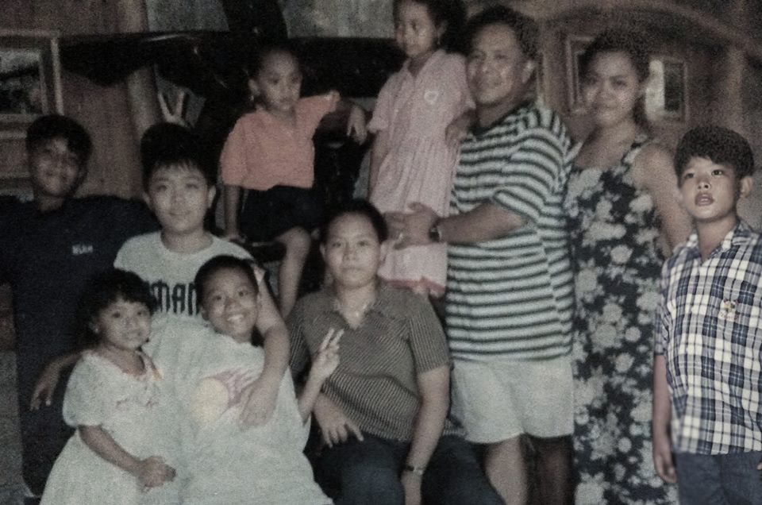
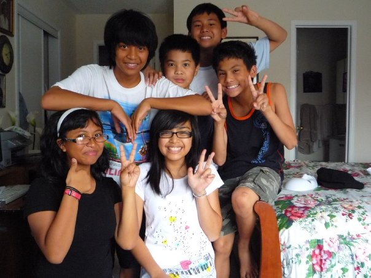
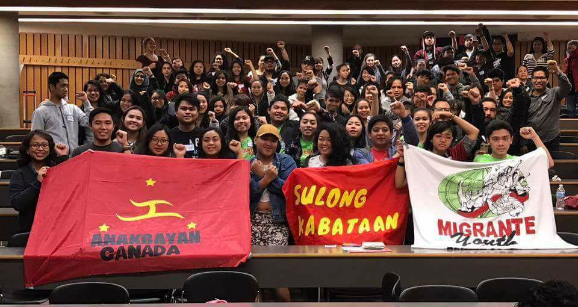

As a second-generation Filipino-Canadian, I have always had a rocky relationship with my identity. This post will be a part of a series of posts in my journey of understanding Philippine history and my place in the FIlipinx diaspora.

Thank you for joining me.

(P.S. This post is a lengthy one, but if you wanted a shorter version, skip ahead to Part Three)

## Part One: Finding Roots

Our family’s last trip to the Philippines, late 1990s (?)

I was born in Canada to newly immigrated Filipino parents. I spent the next eleven years of my life living in a Toronto neighbourhood that many newcomers called home. Our group started small. My brother and I would play with the kids of one family. Then as our parents started finding their way in Canada and met other members of the diaspora, they started seeing each other more, and bringing their kids along. Soon a core group of families would meet almost every week, to celebrate or just be around familiar reminders of the homeland. Their children became friendly faces over the year. They became my friends and eventually—my family.

At my first elementary school, I spent my days with friends who happened to be Filipino. We bonded over shared experiences, common interests, and the immense pressure to do well in school to justify our parents’ migration to Canada.

It was at this point in my life where the Philippines was an occasional part of me. I had only gone back three times in my early childhood so I only had the little things here to cling on to my identity. The snacks. The basketball games. The quick stint at Saturday Filipino language lessons. I knew that it was supposed to be a part of me and I complied.

## Part Two: On and Off

Barkada (group of friends), August 2008

When I was 11, I moved to another city. Connections with the family friends stayed intact. Connections with my Filipino school friends slowly faded away into pre-social media oblivion. Fortunately for me, I moved to a city whose racialized population was steadily growing. I once again found myself with new Filipino friends after connecting over our similar ethnicity.

Things started to change as I grew older. I soon internalized hate towards my own ethnicity, towards new immigrants, towards our people’s unique characteristics. It was trendy to celebrate our “Asian Pride” through the collective love of rice. To speak the occasional word or phrase in Tagalog and celebrate excellent English skills over those who are ESL. To show an immense pride for Filipinos in pop culture. These were all surface level recognition. Anything beyond that were meant we were too “FOB”.

Besides our own family gatherings, the only times I saw Filipinos congregate were for religious reasons. Groups like Youth for Christ were heavily populated with Filipinos. Despite being a devout Catholic, I rejected the level of Filipino-ness. I was Filipino when it was necessary. When our schools needed representation for cultural festivals. When I had to do a class project. Other than that, it was something I denied, or rather, did not think was relevant.

##Part Three: Rediscovery

Sulong Kabataan Conference, November 2016

Soon enough, after following the ideal immigrant child path, I found myself choosing universities. I settled on one that was decently far away to allow me to move away from home. I arrived in Ottawa young, bright-faced and optimistic. It was a new home for the next few years. My social circles’ compositions were different. I soon found myself in spaces where I was one of the few racialized people present. Sometimes my brown skin stood out in a room of Western-appearing people. Growing up as an immigrant child, I always cited my parents as my reason for school and who I aim to serve in my career. This was a novel concept for my non-racialized peers whose families ship them away from at the ripe age of 18.

I felt alone. I felt different. I had to defend my reasons for being on too many occasions, like I had to justify why I am the way I am. Speaking out to an audience who didn’t come for your show was hard. I started realizing that I am the way I am because of my Filipino upbringing. The work ethic. The hospitality. And sometimes, the servility.

I was lost. I felt this gaping hole in myself. Here I was, a child of immigrants who grew up in a fairly nurturing environment and was on the typical millennial trajectory of going to school and entering the workforce. I easily could have put out that fire but something was still burning. I found myself struggling to understand the identity that I denied for years. It’s hard to ignore when my brown skin signals to Canada that I’m not initially from here. I keeping having to explain where I’m from or what my name means. I told myself that I wanted to explore more.

A few months ago, I attended a conference with other Filipino youth. The goal of the conference was to gather students and young people to learn more about Philippine history, culture, and identity; to engage in discussions to connect the realities of Filipinos in the Philippines and abroad; and mobilize youth to achieve national democracy in the Philippines.

Having spent the past year navigating my Filipino identity, I left the conference feeling heavy. I had so much to take in that I didn’t know what to do with all these thoughts until now. These learnings felt different because even though I knew them, it wasn’t until I was around other like-minded Filipinos that I understood.

I understand that I’m privileged. I prepared for the conference the only way I knew how, I researched. I learned that that second-generation Filipinos generally face lower rates of post-secondary education. I was under the impression that Filipinos fell typically under the Asian stereotype, the one where the kids get pressured to do well and go to school.

I understand that I’m colonized. English is my first language. I know how to navigate Canadian life, for the most part, better than my parents and fellow Filipinos who came as youth.

I felt confused and overwhelmed. I convinced myself that the issues in the Philippines and of migrants weren’t my battle and it wasn’t my place.

But my experiences are valid.

I am a product of the ongoing struggles in the Philippines. My parents came here because of the systemic lack of opportunities for our people back home. My mother had been away from her family for decades, initially working as a domestic worker in Singapore before coming to Canada. My father joined my mother in Canada under the promise that Canada has a better standard of living. They gave up trying to teach me my language each day I came back from school more and more Westernized. Their dreams, their ambitions, their livelihoods were rerouted to survival and ensuring that my brother and I thrive.

Up until recently, I was perfectly okay with living a Canadian lifestyle and celebrating my Canadianness. I didn’t have to care about the issues in the Philippines because I’m already here. I’ve made it. But it’s too hard to ignore. Whether I choose to acknowledge it or not, the struggle goes on, in the Philippines, in Canada, and the diaspora around the world. I am here because of the people before me who fought against oppression and for the liberation of our rights, our land, and our people.

I want to connect. I want to contribute to better the livelihood of Filipinos everywhere. This is why I’m going back to the Philippines in the Spring. I’ve only been to back three times and I barely remember it. It will be 15 years since I’ve seen the homeland. Rather than reading up on it, I will be seeing it. Tasting it. Smelling it. Living it. I’m hoping going back can contextualize what I’ve been learning.

I’m terrified of what’s to come and I can’t wait.
